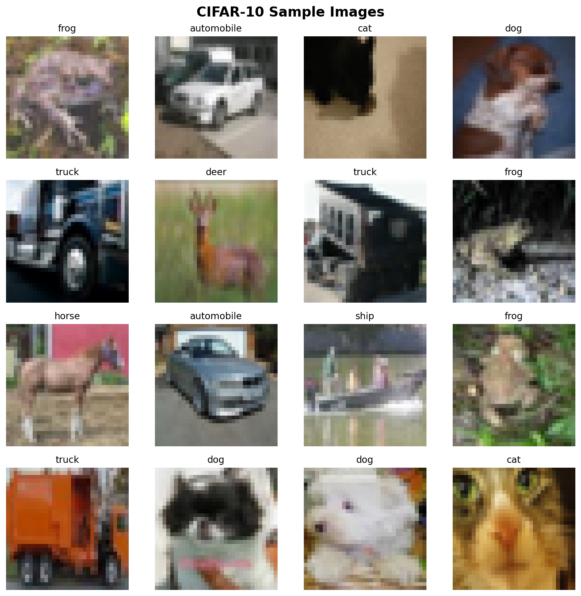
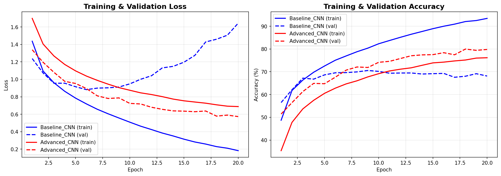
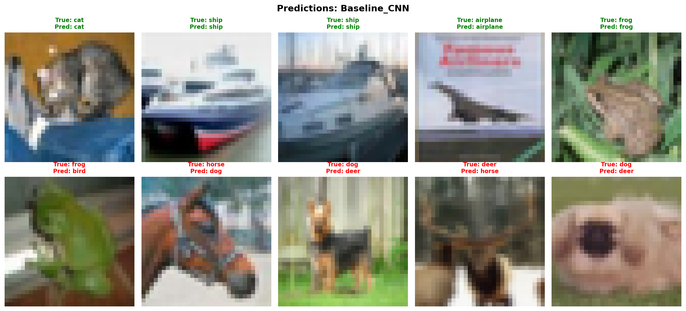
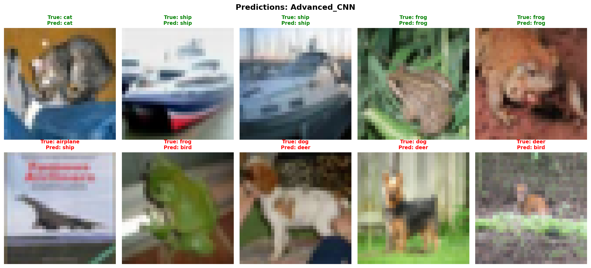

# CNN Architecture Comparison for Image Classification

**ENGR 422 – Computer Vision | Lab Activity 5**  
**Student:** Mohammed Mahdi  

## Overview

This project designs, trains, and compares two different CNN architectures on the **CIFAR-10** dataset to understand how layer combinations affect accuracy, training time, and computational cost.

## Dataset

**CIFAR-10** — 60,000 32×32 color images across 10 classes:  
airplane, automobile, bird, cat, deer, dog, frog, horse, ship, truck.

## Architectures

| Feature | Architecture 1 (Baseline) | Architecture 2 (Advanced) |
|---|---|---|
| Conv blocks | 2 | 3 (6 conv layers) |
| Filters | 16 → 32 | 32 → 64 → 128 |
| Batch Normalization | ✗ | ✓ |
| Dropout | ✗ | ✓ (0.25 / 0.5) |
| Pooling | MaxPool + Flatten | MaxPool + Global Avg Pool |

## How to Run

```bash
# Install dependencies
pip install -r requirements.txt

# Run full pipeline (train + evaluate + compare)
python main.py

# Skip training and just evaluate (if models are already saved)
python main.py --skip-train
```

## Project Structure

```
├── dataset.py           # Data loading, preprocessing, visualization
├── model_baseline.py    # Architecture 1 — simple baseline CNN
├── model_advanced.py    # Architecture 2 — advanced CNN with BN/Dropout
├── train.py             # Training engine
├── evaluate.py          # Evaluation, comparison table, prediction examples
├── main.py              # Main entry point
├── requirements.txt     # Dependencies
└── results/             # Generated plots and comparison outputs
```

## Results

### Sample Images


### Training Curves


### Comparison Table

| Metric | Baseline CNN | Advanced CNN |
|---|---|---|
| Conv blocks | 2 (single conv each) | 3 (double conv each) |
| Total parameters | 153,962 | 175,658 |
| Training epochs | 20 | 20 |
| Final train accuracy | 93.43% | 76.16% |
| Final val/test accuracy | 68.12% | 79.79% |
| **Best val/test accuracy** | **70.57%** | **79.97%** |
| Final train loss | 0.1831 | 0.6879 |
| Final val/test loss | 1.6429 | 0.5733 |
| Training time | 237.0s | 252.3s |

### Prediction Examples

**Baseline CNN:**


**Advanced CNN:**


### Conclusion

Architecture 2 (Advanced CNN) achieved **9.4% higher validation accuracy** (79.97% vs 70.57%) with only 14% more parameters and 15 seconds more training time.

**Key findings:**
- The Baseline CNN **overfits heavily** — 93% train accuracy but only 70% test accuracy (gap of 23%).
- The Advanced CNN **generalizes well** — 76% train vs 80% test, meaning regularization (BatchNorm + Dropout) is effectively preventing overfitting.
- **Batch Normalization** stabilizes training and acts as an implicit regularizer.
- **Dropout** forces the network to learn redundant representations.
- **Global Average Pooling** reduces parameters compared to Flatten while providing spatial invariance.
- The more complex model performed better, confirming that depth + regularization outweighs raw simplicity for this task.
